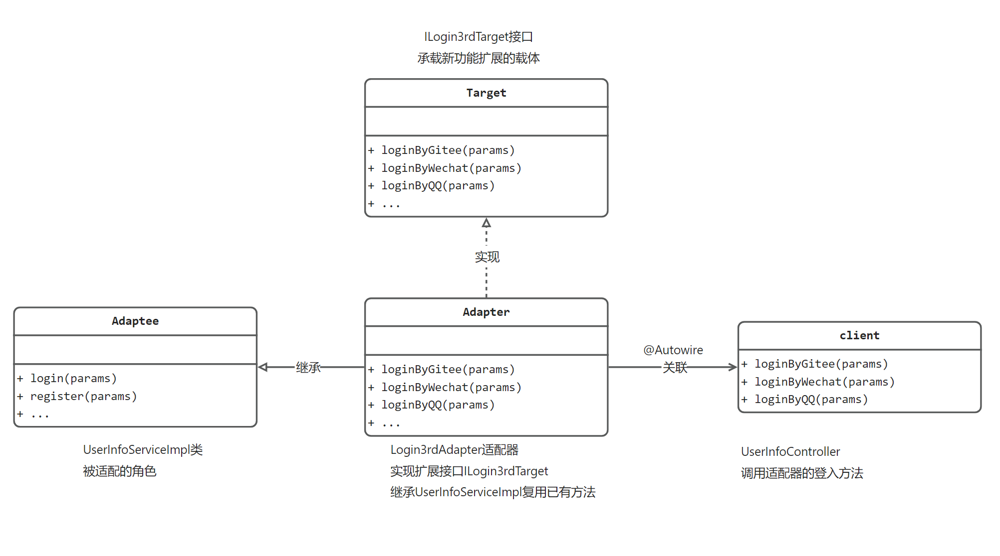

# 《贯穿设计模式学习笔记》

代码已经上传完毕，可以直接运行，如果不能运行，可以直接添加作者微信
```html
<div style="display: flex; gap: 20px;">
	<div style="text-align: left">
		
	</div>
</div>
```
目前UML图和详细学习笔记正在持续更新，由于博主需要给资本家打工卖屁股，所以不能日更请见谅

如果有写的不对或者画的不好的地方，也可以私信提醒我，3q very much!🙏🙏

### 1.适配器模式实现第三方登入

#### UML图解


#### 文章链接
```agsl

```

#### 🙏 赞助

如果你觉得这个项目对你有帮助，并且情况允许的话，可以给我一点点支持，总之非常感谢支持～

```html
<div style="display: flex; gap: 20px;">
	<div style="text-align: center">
		<p>WeChat</p>
		
	</div>
	<div style="text-align: center">
		<p>Alipay</p>
		
	</div>
</div>
```
## License

MIT © [aMetric](./license)
